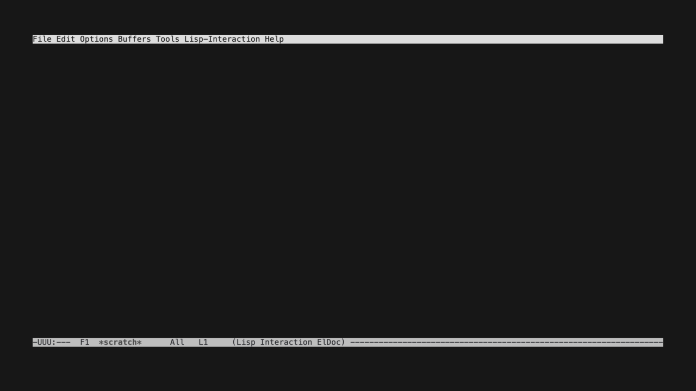

#+title: emacs-nepes
#+description: Nepes color theme for Emacs

Emacs color theme built on modus-themes infrastructure.

Part of the [[https://github.com/kayspark][Nepes Colorscheme]] suite.

* Screenshots

| Dark | Light |
|------+-------|
|  | [[file:docs/light.png]] |

** Demo

| Dark | Light |
|------+-------|
|  |  |

* Installation

1. Clone this repo to =~/.config/emacs/themes/=
2. Add to init:
#+begin_src emacs-lisp
(load-theme 'nepes-dark t)
#+end_src

* Credits

Generated by [[https://github.com/kayspark/nepes-palette][nepes-palette]].
